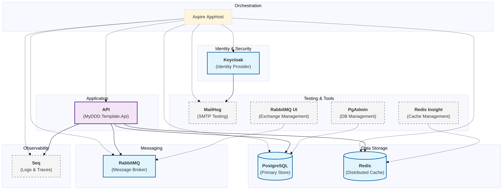

# MyDDD.Template

[](https://dotnet.microsoft.com/download/dotnet/10.0)
[](https://learn.microsoft.com/en-us/dotnet/aspire/)
[](https://wolverine.netlify.app/)
[](https://learn.microsoft.com/en-us/ef/core/)
[](https://scalar.com/)

A production-ready .NET 10 template based on **Domain-Driven Design (DDD)** principles. This template is orchestrated with **.NET Aspire** to provide a seamless development and deployment experience with built-in observability, security, and infrastructure management.

---
## 🚀 Key Features

### 🧩 Domain-Driven Design (DDD)
- **Rich Domain Model**: Implementation of Aggregate Roots, Entities, and Value Objects.
- **Invariants & Business Rules**: Strong protection of system integrity within the Domain layer.
- **Domain Events**: Handled via **Wolverine** for robust side-effect management.

### ⚡ Wolverine Messaging
- **Wolverine Integration**: Advanced messaging infrastructure for command and event handling.
- **Outbox Pattern**: Reliable domain event publishing through Wolverine's native outbox.
- **Asynchronous Processing**: Background task execution and message routing.

### 🌐 .NET Aspire Orchestration
- **Infrastructure-as-Code**: Orchestration of Postgres, Redis, RabbitMQ, Keycloak, and Seq within C#.
- **Dashboard**: Real-time observability, logs, and resource management.
- **Service Discovery**: Built-in resolution of service endpoints with Aspire components.

### 🛡️ Security & Observability
- **Keycloak Identity**: Integrated OIDC authentication and identity synchronization (JIT User Sync).
- **OpenTelemetry**: Native tracing and metrics exported to **Seq**.
- **Structured Logging**: Comprehensive Serilog integration.

### 🧪 Testing Excellence
- **Layered Unit Testing**: Separated projects for Domain, Application, and Infrastructure tests.
- **Fluent Assertions**: Expressive, human-readable test assertions.

---

## 🏗️ Project Structure

| Project | Description |
| :--- | :--- |
| **src/Domain** | Enterprise logic: Entities, Value Objects, Domain Events, Repositories. |
| **src/Application** | Use Cases: Commands, Queries, Validators, and DTOs. |
| **src/Infrastructure** | Implementation of interfaces: Persistence (EF Core), Auth, External APIs. |
| **src/Api** | Entry point: Minimal API endpoints, Global Exception Handling, Swagger/Scalar. |
| **infra/AppHost** | Aspire Orchestrator: Defines project relationships and infrastructure. |
| **infra/ServiceDefaults** | Shared extensions for OTEL, Health Checks, and Service Discovery. |
| **tests/** | Layer-matched unit test projects. |

### 🧩 Messaging & Outbox (Wolverine + RabbitMQ)
- **Wolverine** acts as the core application engine, handling both in-process command execution and distributed messaging.
- **RabbitMQ** is used as the external transport for Wolverine, allowing for reliable communication between services and asynchronous processing of heavy tasks.
- **Transactional Outbox**: By integrating Wolverine directly with EF Core, the template ensures that any messages or domain events are only sent if the database transaction successfully commits. This prevents "ghost" messages and ensures eventual consistency.

## 📦 Infrastructure Containers

This project uses **.NET Aspire** to orchestrate the following infrastructure components. The diagram below illustrates how the services are interconnected within the development environment.



---

## 🛡️ Identity & JIT Sync (Keycloak)
- **Keycloak** is the centralized Identity Provider (IDP), managed easily through the Aspire dashboard during development.
- **JIT User Synchronization**: Upon a successful login, the application automatically ensures the user exists in the local PostgreSQL database (JIT Sync). This includes syncing the `IdentityId` from Keycloak with the local `UserId`, enabling seamless relationship management between business entities and users.
- **OAuth2/OIDC**: Secured using the standard OpenID Connect flow, with built-in support for token validation and user context injection.

### 📊 Persistence & Observability (EF Core + Seq)
- **PostgreSQL** is the primary relational store, with **EF Core** providing a high-performance, strongly-typed data access layer using snake_case conventions.
- **OpenTelemetry** is pre-configured to export traces and metrics to **Seq** (or any OTLP-compatible collector), providing deep visibility into every request, command, and database query.

---

## 🏁 Getting Started

### 🛠️ Prerequisites
- [.NET 10 SDK](https://dotnet.microsoft.com/download/dotnet/10.0)
- [Docker](https://www.docker.com/) / [Podman](https://podman.io/) (for Aspirated services)
- [dotnet aspire workload](https://learn.microsoft.com/en-us/dotnet/aspire/fundamentals/setup-tooling)

### 1. Installation & Use as Template
You can install this repository as a `dotnet new` template:
```bash
# Install the template from the local directory
dotnet new install .

# Create a new project from the template
dotnet new myddd-std -n MySuperApp
```
*The template engine will automatically replace all namespaces and directory names.*

### 2. Local Run
To start the entire stack:
```bash
dotnet run --project infra/MyDDD.Template.AppHost
```
This will launch the Aspire dashboard, where you can find URLs for the API, Keycloak, and Seq.

---

## 🧪 Testing

Run all tests from the root:
```bash
dotnet test
```

Projects are split into:
- `Domain.UnitTests`: Pure business logic verification.
- `Application.UnitTests`: Use case and command handler verification.
- `Infrastructure.UnitTests`: Middleware and helper verification.

---

## Built With

This template leverages the best of the modern .NET ecosystem:

- **[.NET 10](https://dotnet.microsoft.com/download/dotnet/10.0)**
- **[.NET Aspire](https://learn.microsoft.com/en-us/dotnet/aspire/)**
- **[Wolverine](https://wolverine.netlify.app/)**
- **[EF Core](https://learn.microsoft.com/en-us/ef/core/)**
- **[PostgreSQL](https://www.postgresql.org/)**
- **[Redis](https://redis.io/)**
- **[RabbitMQ](https://www.rabbitmq.com/)**
- **[Keycloak](https://www.keycloak.org/)**
- **[Scalar](https://scalar.com/)**
- **[FluentAssertions](https://fluentassertions.com/)**
- **[FluentValidation](https://github.com/FluentValidation/FluentValidation)**
- **[xUnit](https://xunit.net/)**
- **[Serilog](https://serilog.net/)**

---

## 📜 License
This project is licensed under the [MIT License](LICENSE).
